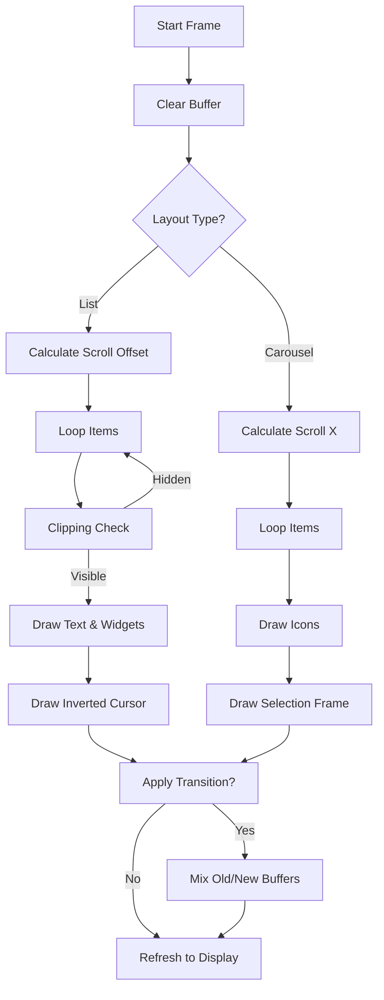

# MLCD 菜单框架与动画系统深度设计文档

本文档深入解析本项目中基于 Memory LCD (MLCD) 的轻量级嵌入式菜单框架及动画系统的技术实现。本文档不仅涵盖设计理念，还包括数据结构内存布局、核心算法原理及渲染管线细节，旨在为开发者提供全面的技术参考。

---

## 1. 核心设计理念

*   **轻量级 (Lightweight)**: 使用单向链表结构管理菜单项，内存占用极低且动态可扩展，完美适配 STM32 等资源受限的嵌入式环境。
*   **物理引擎驱动 (Physics-Driven)**: 摒弃传统的线性或贝塞尔插值，引入二阶弹簧阻尼模型 (Spring-Damper) 驱动 UI 元素，实现自然、跟手且具有惯性的交互体验。
*   **有序抖动过渡 (Ordered Dithering Transition)**: 利用 Bayer 矩阵算法在 1-bit 黑白屏幕上实现类似“淡入淡出”的视觉虚化效果，突破硬件色彩限制。
*   **架构解耦 (Decoupled Architecture)**: 采用 MVC (Model-View-Controller) 变体思想，将数据模型 (Menu)、渲染视图 (Render)、动画控制器 (Animation) 与硬件驱动 (MLCD Driver) 严格分离。

---

## 2. 菜单框架架构 (Menu Framework)

### 2.1 数据结构与内存布局

菜单系统基于链表结构，这意味着菜单项在内存中不必连续存储，可以灵活增删。

#### 2.1.1 菜单项 (MenuItem) - 节点模型
`MenuItem_t` 是构成菜单的基本单元。

```c
typedef struct MenuItem {
    const char *label;          // [4B] 显示文本指针 (存储在 Flash)
    MenuItemType_t type;        // [1B] 类型枚举 (ACTION, SUBMENU, VALUE...)
    
    // --- 联合体概念 (逻辑上复用) ---
    struct MenuPage *submenu;   // [4B] 子菜单指针 (仅 SUBMENU 类型有效)
    MenuCallback_t callback;    // [4B] 触发回调 (ACTION/VALUE 类型)
    void *data;                 // [4B] 数据绑定指针 (bool* 或 int32_t*)
    
    // --- 数值控制参数 (仅 VALUE 类型有效) ---
    int32_t min_val, max_val, step; 
    
    struct MenuItem *next;      // [4B] 下一个节点指针
    const uint8_t *icon;        // [4B] 图标位图指针
} MenuItem_t;
```

**内存视图示意**:
```text
[Page Head] -> [Item A] -> [Item B] -> [Item C] -> NULL
                 |           |
               (Action)    (SubMenu) -> [SubPage Head] -> ...
```

#### 2.1.2 菜单页面 (MenuPage) - 容器模型
`MenuPage_t` 负责管理一个菜单屏幕的上下文。

```c
typedef struct MenuPage {
    const char *title;          // 页面标题
    MenuLayout_t layout;        // 布局策略：LIST (列表) / CAROUSEL (轮播)
    
    MenuItem_t *head;           // 链表头指针
    MenuItem_t *tail;           // 链表尾指针 (优化 O(1) 插入)
    uint8_t item_count;         // 缓存项目总数 (优化循环边界)
    
    // --- 状态保存上下文 ---
    // 当从子菜单返回时，需要恢复父菜单的选中位置和滚动条位置
    uint8_t selected_index;     // 当前逻辑选中项
    float scroll_y;             // 当前视觉滚动位置 (像素级)
    
    struct MenuPage *parent;    // 父级反向指针 (实现 Back 逻辑)
} MenuPage_t;
```

### 2.2 导航与状态机

#### 2.2.1 页面堆栈管理 (Implicit Stack)
框架不维护全局页面堆栈数组，而是利用 `MenuPage_t` 中的 `parent` 指针形成隐式链表。
*   **进入 (Enter)**: `Current -> SubMenu`, 设置 `SubMenu->parent = Current`。
*   **返回 (Back)**: `Current = Current->parent`。

#### 2.2.2 输入处理状态机
`Menu_Loop` 中的输入处理逻辑如下：

1.  **扫描输入**: 获取编码器增量 `diff` 和按键事件 `key`。
2.  **模式分发**:
    *   **常规导航模式 (Navigation Mode)**:
        *   `diff` 修改 `selected_index`。
        *   触发 `Animation_Spring_SetTarget` 更新光标目标。
    *   **数值编辑模式 (Value Edit Mode)**:
        *   仅当当前项为 `MENU_ITEM_VALUE` 且被点击选中时进入。
        *   `diff` 修改 `item->data` 指向的数值。
        *   `key == BACK` 退出编辑模式。

---

## 3. 动画系统 (Animation System)

### 3.1 弹簧阻尼物理引擎 (Spring-Damper Physics)

为了实现类似 iOS 的橡皮筋滚动效果，我们使用二阶微分方程模拟物理弹簧。

#### 3.1.1 物理模型
系统状态由位置 $x$ 和速度 $v$ 描述。
$$ a = \frac{F}{m} = -k(x - target) - c \cdot v $$
(假设质量 $m=1$)

*   **刚度 (Stiffness $k$)**: 决定弹簧“硬度”，值越大回弹越快。典型值：100.0。
*   **阻尼 (Damping $c$)**: 决定能量耗散，值越小震荡越久。典型值：10.0 - 15.0 (欠阻尼到临界阻尼)。

#### 3.1.2 数值积分 (Semi-Implicit Euler)
在 `Animation_Spring_Update` 中使用半隐式欧拉积分法，比标准欧拉法更稳定：

```c
float Animation_Spring_Update(SpringAnim_t *anim, float dt) {
    float displacement = anim->position - anim->target;
    float force = -anim->stiffness * displacement - anim->damping * anim->velocity;
    
    // 1. 先更新速度
    anim->velocity += force * dt;
    // 2. 再更新位置 (使用新速度)
    anim->position += anim->velocity * dt;
    
    return anim->position;
}
```

### 3.2 Bayer 有序抖动过渡 (Ordered Dithering Transition)

在 1-bit 屏幕上，像素只有黑白两种状态。为了模拟灰度级过渡（淡入淡出），我们使用空间换时间的抖动算法。

#### 3.2.1 算法原理
使用 4x4 Bayer 矩阵作为阈值 Map：
$$
M_{4\times4} = \begin{bmatrix}
0 & 8 & 2 & 10 \\
12 & 4 & 14 & 6 \\
3 & 11 & 1 & 9 \\
15 & 7 & 13 & 5
\end{bmatrix}
$$

**渲染流程 (`Animation_Transition_Apply`)**:
1.  **捕获阶段**: 切换开始时，将旧页面显存拷贝到 `old_page_buffer`，新页面在后台渲染到 `new_page_buffer`。
2.  **混合阶段**: 每一帧计算全局阈值 $T = progress \times 16$ (0~16)。
3.  **像素判定**:
    对于屏幕坐标 $(x, y)$：
    *   获取局部阈值 $B = M[y\%4][x\%4]$。
    *   若 $T > B$: 显示 **新页面** 像素。
    *   若 $T \le B$: 显示 **旧页面** 像素。

**视觉效果**: 随着 $T$ 增加，屏幕上的像素点会按照 Bayer 矩阵定义的特定散乱顺序，逐个从旧画面切换到新画面，产生均匀的“溶解”效果。

---

## 4. 渲染管线 (Rendering Pipeline)

渲染系统采用 **即时模式 (Immediate Mode)**，每帧重绘整个屏幕，但通过 **脏矩形 (Dirty Rect)** 思想（虽然这里是全屏刷新，但在绘图函数层级做了优化）和 **双缓冲** 保证流畅。

### 4.1 渲染流程图



### 4.2 关键技术细节

#### 4.2.1 视口裁剪 (Viewport Clipping)
在列表模式下，菜单项可能有几十个，但屏幕只能显示几行。
```c
// 计算每一项的屏幕Y坐标
int item_y = (i * ITEM_HEIGHT) - (int)current_scroll + start_y;

// 裁剪检查：只绘制在屏幕可视范围内的项
if (item_y < start_y - ITEM_HEIGHT || item_y > MLCD_HEIGHT) continue;
```
这极大地减少了 `MLCD_DrawString` 的调用次数，保证了高帧率。

#### 4.2.2 滚动条跟随策略
滚动动画 (`scroll_anim`) 的目标值计算策略：
*   **目标**: 尽量让光标 (`cursor_y`) 保持在屏幕可视区域的垂直居中位置。
*   **公式**: `target_scroll = cursor_y - (SCREEN_VISIBLE_LINES / 2) * ITEM_HEIGHT`
*   **边界限制 (Clamping)**: 确保 `target_scroll` 不会小于 0，也不会超过最大滚动范围。

---

## 5. 接口与扩展性设计

### 5.1 构建示例 (Building a Menu)

无需了解底层链表，只需调用 API 即可构建复杂菜单。

```c
void Setup_Menus(void) {
    // 1. 创建页面
    MenuPage_t *main_page = Menu_CreatePage("Main Menu");
    MenuPage_t *settings_page = Menu_CreatePage("Settings");
    
    // 2. 绑定子菜单
    Menu_AddSubMenu(main_page, "Settings", settings_page);
    
    // 3. 添加功能项
    // 开关：直接绑定 bool 变量
    static bool sound_on = true;
    Menu_AddToggle(settings_page, "Sound", &sound_on, NULL);
    
    // 数值：直接绑定 int32 变量，设定范围 0-100，步进 5
    static int32_t brightness = 80;
    Menu_AddValue(settings_page, "Bright", &brightness, 0, 100, 5, OnBrightnessChange);
    
    // 4. 初始化
    Menu_Init(main_page);
}
```

### 5.2 扩展新类型
若需添加新的控件（例如进度条 `MENU_ITEM_PROGRESS`）：
1.  在 `MenuItemType_t` 枚举中添加新类型。
2.  在 `Menu_Add*` 系列函数中添加 `Menu_AddProgress` 构造器。
3.  在 `Menu_Loop` 的渲染 switch-case 中添加绘制逻辑。
4.  在输入处理逻辑中添加对应的交互逻辑（如左右键调节进度）。
